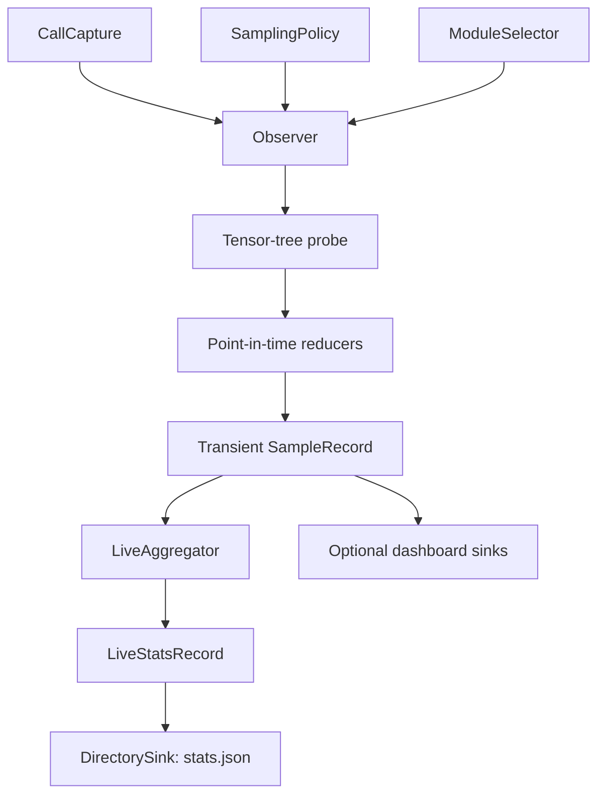

# TorchInstruments: live PyTorch model telemetry

**Author**: Vadym Stupakov <vadim.stupakov@gmail.com>

**Status**: Draft

**Created**: 2026-08-14

**Authoritative URL**: https://github.com/Red-Eyed/torchinstruments

## Objective

Instrument a PyTorch model once, train normally with any trainer or custom loop, and continuously
maintain bounded per-layer evidence suitable for researchers, dashboards, and LLM analysis.

## Goals

- Require no calls inside the training loop.
- Add negligible work to unsampled forwards.
- Never persist raw tensors.
- Describe distribution shape, tails, drift, volatility, oscillation, and regime changes.
- Bound memory independently of training duration.
- Persist one atomically updated, versioned JSON record.
- Keep capture, sampling, selection, reduction, aggregation, and sinks replaceable.
- Preserve model outputs, gradients, parameters, buffers, and checkpoint compatibility.

## Non-goals

- Persisting every sampled observation or reconstructing a complete historical series.
- Observing optimizer updates without an optimizer boundary.
- Calling a sampled root forward a training step.
- Depending on Lightning, TensorBoard, W&B, or Accelerate in the core wheel.
- Claiming distributed, CUDA-performance, or `torch.compile` support before dedicated tests.

## Architecture



The observer is an imperative orchestration shell. Tensor reduction and indicator calculations are
independent components. The directory sink owns filesystem side effects; aggregation never reads
or writes files.

## Public workflow

```python
inject_observer(
    model,
    interval=timedelta(minutes=1),
    output_dir="stats",
)
```

`inject_observer()` mutates the model in place and returns `None`. A duplicate injection raises
`ObserverAlreadyAttachedError`. `remove_observer(model)` detaches capture, removes graph-local
gradient callbacks, restores observer-owned forward wrappers, closes sinks, and removes private
observer state.

Native hooks capture normal `module(...)` dispatch. Literal `.forward(...)` users select reversible
wrappers:

```python
inject_observer(model, capture_direct_forwards=True)
```

## Sample lifecycle

A root capture boundary chooses sampling once. A sampled forward receives a unique sample ID and
an independent context, so multiple forwards may remain outstanding before backward.

Selected-module callbacks reduce outputs while the context is active. The observer emits a
transient `forward_complete` `SampleRecord`. A graph-local multi-gradient hook binds output
gradients to tensors from that exact forward. The first correlated backward emits a transient
`backward_observed` event containing only newly relevant gradient measurements and errors.

No sink is required to persist these events. `DirectorySink` folds them into live state;
`MetricLoggerSink` and `TensorBoardSink` project them immediately.

## Point-in-time distribution profile

The fused default reducer operates on finite values in a safe floating dtype and emits:

- mean, population standard deviation, RMS, extrema, mean absolute value, and L1/L2 norms;
- finite, zero, positive, and negative fractions;
- skewness and population excess kurtosis;
- `p01`, `p05`, `p25`, median, `p75`, `p95`, `p99`, and `p999`;
- `p99_abs`, `p999_abs`, IQR, and central 98% range;
- max/RMS and absolute-quantile/RMS ratios;
- tail fraction beyond three standard deviations;
- normalized magnitude entropy and effective magnitude support.

Unavailable scalars carry reasons rather than JSON null, NaN, or infinity. Quantiles and higher
moments execute only on sampled forwards, but they are intentionally more expensive than the
previous scale-only profile.

## Live temporal indicators

`LiveAggregator` creates a bounded series for configured diagnostic metrics. Every series retains
first/latest/minimum/maximum points, count, and warm-up state. Its default indicator bank includes:

- population mean, standard deviation, RMS, and coefficient of variation over time;
- fast/slow EMAs and relative gap;
- absolute and relative momentum at 1, 5, and 20 observations;
- online linear-regression slope and `R²`;
- exponentially weighted change and volatility;
- latest z-score against prior history;
- drawdown, runup, and historical-range position;
- directional up/down balance;
- positive and negative CUSUM;
- recent lag-one autocorrelation, oscillation fraction, and directional runs.

Recent windows are bounded by configuration. Running moments, regression sums, EMAs, extrema, and
CUSUM require constant state. Separate limits bound temporal series, tensor paths, module-call
positions, histogram identities, and distinct instrumentation failures. Dropped series identities
and rejected structural observations are counted rather than silently expanding memory.

`latest_statistics` retains the complete current distribution profile. Rich temporal series are
maintained only for configured `temporal_metrics`, preventing a Cartesian explosion between every
point statistic and every technical indicator.

## Histograms

Histograms remain opt-in and have an independent every-N-samples cadence. Fixed edges are exactly
mergeable by adding bin, underflow, overflow, finite, and non-finite counts plus moments. Dynamic
edges retain the latest histogram but make the aggregate explicitly unavailable after edges
change. Source tensors never reach sinks.

## Canonical output

```text
stats/
    index.md
    stats.json
```

`stats.json` contains run metadata, module catalog, live forward and backward indicators, current
metadata, histogram summaries, observer overhead, and bounded errors. The file is strict UTF-8
JSON, sorted deterministically, and atomically replaced after durable temporary-file flushing.

`index.md` is a derived, bounded guide with a ready-to-use LLM prompt. It contains no additional
telemetry.

## TensorBoard and custom loggers

Dashboard sinks consume the transient `SampleRecord` before it is discarded. Sample IDs become
dashboard steps because there is no universal optimizer-step counter. The supplied logger remains
caller-owned.

TensorBoard retains its own per-sample event history. The final `stats.json` intentionally retains
bounded indicators rather than enough values to replay that complete history. Fixed histogram
aggregates and current distributions remain available in JSON.

## Performance and scale

Unsampled module callbacks return after one context lookup. Sampled reductions run on the tensor
device and transfer only compact scalars or histogram records. JSON size scales with selected
module/call/tensor paths and configured temporal metrics, not training duration.

Atomic rewriting cost scales with the live file size. A future asynchronous sink can be added
without changing capture, reducers, or aggregation.

## Error isolation

`raise`, `warn`, and `ignore` policies remain available; `warn` is the default. Non-raising errors
are aggregated by module, probe, exception type, and message with first/latest timestamps and
counts. The observer reports each lifecycle error once so forward errors are not double-counted
when backward later arrives.

## Resolved decisions

### Live state instead of samples on disk

**Decision**: Do not persist sampled-forward files. Maintain one live distribution and indicator
record. This bounds storage by model structure and makes the primary artifact directly usable by
an LLM.

### Distribution shape

**Decision**: Mean and standard deviation are insufficient for skewed, heavy-tailed, concentrated,
or multimodal values. Include higher moments, quantiles, tail ratios, entropy, and optional
histograms.

### Temporal analysis

**Decision**: Treat important per-layer metrics as bounded time series. Use descriptive indicator
names instead of finance acronyms, expose warm-up, and avoid opaque composite health scores.

### Forward/backward correlation

**Decision**: Keep an independent context and graph-local hook per sampled forward. A single global
collection flag cannot correlate multiple outstanding graphs.

### Direct forward calls

**Decision**: Keep native hooks as the default. Direct `.forward(...)` calls bypass PyTorch hooks,
so an explicit reversible wrapper strategy handles models that use them internally.

## Open issues

- Module inputs, `grad_input`, parameters, and parameter gradients are not yet observed.
- Cross-layer ranks and neighboring-layer amplification need a synchronized layer-level pass.
- Multiple distributed ranks need explicit output ownership and directory policies.
- Both `torch.compile` injection orderings require compatibility tests.
- Very large selected module sets may benefit from asynchronous or sharded live sinks.

## Roadmap

1. Add input, `grad_input`, parameter, and parameter-gradient signals.
2. Add cross-layer amplification, attenuation, and peer-rank indicators.
3. Add layout-agnostic per-channel and quantization diagnostics.
4. Add distributed output and compilation compatibility.
5. Add optional Transformer, attention, OCR, CNN, and quantization-readiness recipes.
