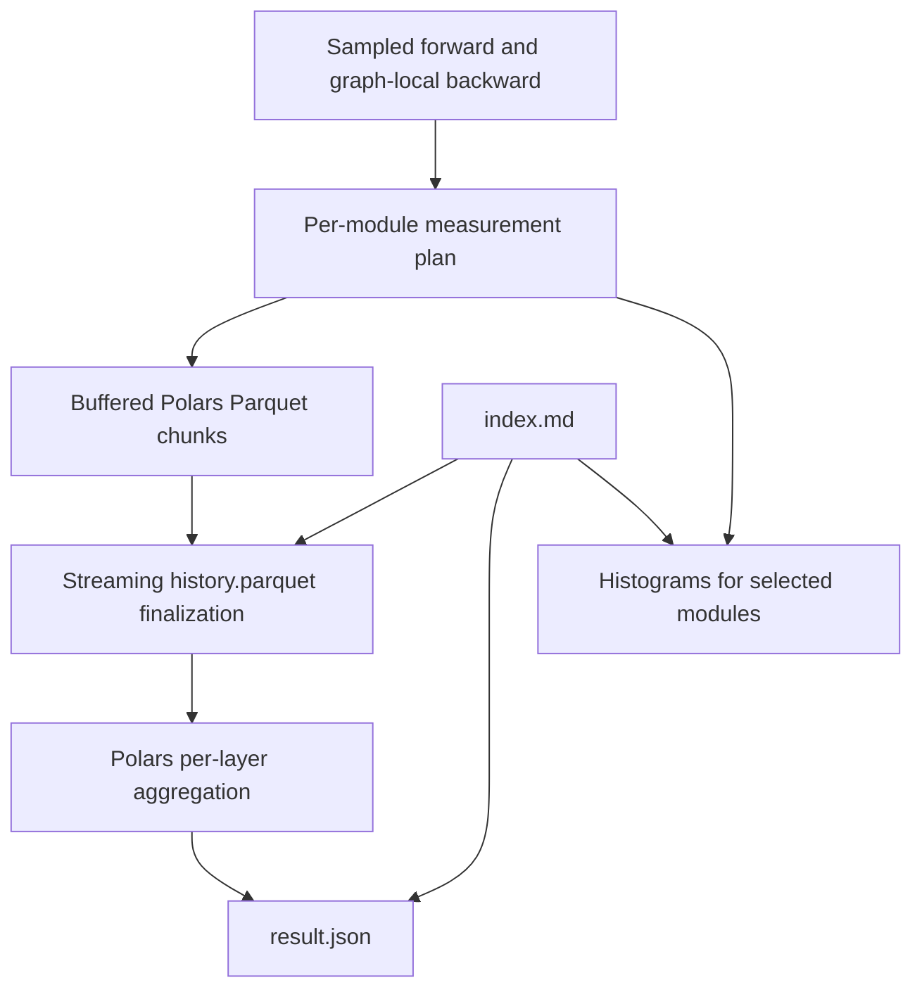

# Per-layer PyTorch measurement history

Author: Vadym Stupakov <vadim.stupakov@gmail.com>
Created: 2026-08-14; revised: 2026-09-24
Status: Implemented; reliability changes pending release
Authoritative URL: https://github.com/Red-Eyed/torchinstruments

## Objective and background

Collect measurements across many model layers and retain enough history for a researcher to
investigate trends. The earlier ranked-report design replaced measurements with selected findings
and exposed too much diagnostic machinery. A histogram-only design would expose thousands of
TensorBoard series. This version combines full scalar history, per-layer summaries, and focused
histograms. All three outputs and their reading guide are required.

## Goals

- Keep the existing attach/train/remove workflow and preserve model execution.
- Record every successfully collected scalar observation and every selected layer identity.
- Use Polars for Parquet IO, table queries, aggregation, and JSON export.
- Give the LLM index.md as an entry point explaining data, sampling, and uncertainty.
- Restrict expensive histogram collection before reduction with an explicit module budget.
- Demonstrate diagnosis through controlled baseline/broken/fixed examples.

No automatic diagnoses, ranking, cross-layer health scores, causal conclusions, or inferred
optimizer steps are part of telemetry. The observer does not measure task loss or accuracy.

## Data flow

## Storage and semantics

History is a long table with one row per statistic. Layer, call index, signal, tensor path,
sample ID, forward index, UTC timestamp, shape, and dtype establish its meaning. Values may be
nullable only alongside an unavailable reason. Default measurements are mean, population std,
min, max, p25, p50, p75, zero fraction, and nonfinite fraction.

Each module call snapshots its train/eval mode and whether autograd recording is enabled.
Both are part of history and summary identities; delayed backwards retain the original context.
Old histories without these fields are rejected rather than assigned an inferred mode.

Tensor gradient hooks are registered at the module output, before downstream in-place mutation
can rebase the gradient edge. A sample-local owner uses PyTorch's private engine completion
callback to publish its first backward once. This dependency is isolated in gradient_capture.py
and tested for backward(), autograd.grad(), unused branches, and retained graphs. It does not
retain source tensors. Independent reducer adapters preserve successful sibling measurements
under warn/ignore policies; explicit raise still propagates the failure.

Completed chunks can be queried during training. At initialization and after each sampled event,
Polars streams chunks into an atomic history.parquet snapshot, then refreshes result.json.
Removal closes resources and cleans up chunks; it is not required to read any artifact.
An interrupted run keeps completed chunks and the last published files. Each file is atomic,
but readers may see different refreshes across files. Snapshot rewrites and summary aggregation
run synchronously, so their cost grows with collected history; summary output
size grows with observed layer/call/path identities, not with run duration.

JSON is an array of layer records. Each contains tensor identities and metric summaries:
counts, whole-history mean, population std, min/max, linearly interpolated quartiles, and
two adjacent window means. Metrics are keyed by name; sample records stay in Parquet. Delayed backwards
are ordered by originating sample ID. Window means average sample statistics; they are not
pooled tensor distribution statistics. Selected but unexecuted modules have empty tensor lists.

All layer summaries are retained. Consequently, JSON is not subject to the old byte budget.
Python buffering is bounded by configured rows. Polars performs final aggregation in its
streaming engine; native query working memory still depends on grouping and ordering.

## Histogram and writer ownership

At attachment, API wiring builds one measurement plan per selected module. Default plans use
histograms on the first eight selected modules; explicit selection and limits are available.
Call capture knows only the resulting plans. Scalar history covers every selected module.
Histogram reducers transfer compact bin counts and moments, never raw tensors, to the event writer.

DirectorySink owns and closes its writer. Additional TensorBoardSink instances can wrap external
writers or Lightning loggers without closing them. Rank-zero policy avoids all work elsewhere;
all-rank policy isolates directories and preserves rank identity in each guide.

## Alternatives

- Ranked JSON: removed because interpreting evidence belongs to the researcher or LLM.
- All-layer TensorBoard histograms: too many series and unnecessary collection cost.
- Growing JSON history: repetitive and inefficient to query and rewrite.
- PyArrow Parquet implementation: Polars is the required table/storage/aggregation dependency.
- Finalization-only JSON: leaves summaries unavailable during execution. Refreshing on sampled
  events provides live summaries with exact history quantiles, at the cost of rescanning history.

## Validation

Check model output/gradient invariance, shared modules, nested outputs, delayed/unused backwards,
empty and nonfinite tensors, histogram focus before reduction, buffer bounds, rank isolation,
writer ownership, and real TensorBoard replay. Verify each example's fault signature against its
fixed run. CPU tests do not establish CUDA performance or torch.compile compatibility.

Native MPS collection and non-reentrant checkpointing are tested. Reentrant internal gradient
capture remains unsupported: original internal forwards expose grad_enabled=false, while
recomputation is not assigned a guessed sample. Parameter gradients can exist despite this gap.
The timed sampler now collects the first forward immediately. See the
[reliability plan](reliability-plan.md) and [benchmark evidence](../benchmarks/README.md).
