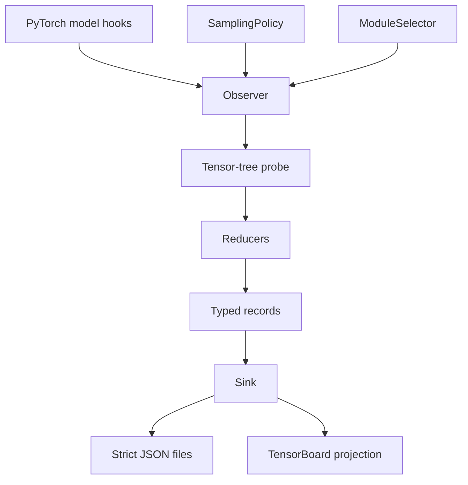

# TorchInstruments: Passive PyTorch Model Telemetry

**Author**: Vadym Stupakov <vadim.stupakov@gmail.com>

**Status**: Draft

**Created**: 2026-08-14

**Authoritative URL**: https://github.com/Red-Eyed/torchinstruments

## Table of contents

- [Objective](#objective)
- [Background](#background)
- [Goals](#goals)
- [Non-goals](#non-goals)
- [Architecture](#architecture)
- [Interfaces](#interfaces)
- [Snapshot lifecycle](#snapshot-lifecycle)
- [Output](#output)
- [Performance constraints](#performance-constraints)
- [Resolved issues](#resolved-issues)
- [Open issues](#open-issues)
- [Roadmap](#roadmap)

## Objective

Provide useful model-training telemetry by instrumenting a PyTorch model once and then letting
the user train normally with any trainer or custom loop.

## Background

Training diagnostics are commonly coupled to a trainer, dashboard, or explicit calls inside the
training loop. That makes them hard to reuse across custom trainers, Lightning, Accelerate, and
research scripts. TorchInstruments instead observes module execution through local PyTorch hooks
and persists compact, self-describing JSON suitable for human and LLM analysis.

The package is trainer-agnostic, not framework-independent: PyTorch is its only core runtime
dependency.

## Goals

- Require one injection call and no training-loop callbacks.
- Add negligible work to unsampled forwards.
- Never copy or persist full activations as telemetry.
- Keep sampling, selection, reduction, records, and persistence independently replaceable.
- Preserve model outputs, gradients, parameters, buffers, and checkpoint compatibility.
- Produce deterministic, versioned JSON structures with descriptive field names.

## Non-goals

- Observing optimizer updates in the generic observer. PyTorch module hooks cannot universally
  identify optimizer-step boundaries.
- Calling a root forward a training step. A trainer may perform several forwards per optimizer
  step, or perform forwards without optimization.
- Depending on TensorBoard, W&B, Lightning, or Accelerate in the core package. Optional adapters
  may target their structural protocols without importing those frameworks.
- Persisting raw tensors by default.
- Claiming `torch.compile` compatibility before both injection orderings are tested.

## Architecture



The observer is an orchestration shell. Tensor traversal and reduction are functional core
operations. The clock, selection policy, reducers, and sink are injected dependencies.

## Interfaces

### Minimal API

```python
inject_observer(
    model,
    interval=timedelta(minutes=1),
    output_dir="stats",
)
```

`inject_observer()` mutates the model by attaching hooks and returns `None`. A second injection
raises `ObserverAlreadyAttachedError`.

```python
remove_observer(model)
has_observer(model)
```

### Configurable API

```python
inject_observer(
    model,
    sampler=AlwaysSampler(),
    selector=leaf_modules(),
    reducers=default_reducers(),
    histograms=[
        histogram(
            bins=64,
            value_range=(-8.0, 8.0),
            every_n_snapshots=10,
        ),
    ],
    sink=DirectorySink("stats"),
)
```

Convenience arguments and their corresponding injected components are mutually exclusive.

TensorBoard is adapted at the sink boundary without adding trainer dependencies to the core:

```python
inject_observer(
    model,
    sink=CompositeSink(
        DirectorySink("stats"),
        TensorBoardSink(logger),
    ),
)
```

`TensorBoardSink` uses snapshot IDs as logger steps because root forwards cannot be mapped
universally to optimizer steps. It projects scalars and pre-aggregated histograms from normalized
records and never receives raw tensors. The adapter never finalizes an externally owned logger.
The directory sink remains canonical and contains every value required to replay dashboard events.

## Snapshot lifecycle

A sampling decision is made only at the root model's forward pre-hook. Every sampled root
forward receives a unique snapshot ID and an independent context, so multiple forwards may be
outstanding before a backward pass.

Selected module hooks collect outputs only while that context is active. At the root forward
post-hook, the sink writes a `forward_complete` snapshot immediately. This guarantees useful
output for inference-only runs.

PyTorch's graph-local multi-gradient hook binds observed output gradients to tensors from that
exact forward. When those gradients arrive, the same snapshot is atomically replaced with a
`backward_observed` record. Only the first backward through a sampled graph is recorded in Phase
1. Gradient accumulation across different root forwards remains correctly separated by snapshot.

## Output

```text
stats/
    index.md
    run.json
    modules.json
    snapshots/
        000000.json
        000001.json
```

`index.md` is a bounded, atomically updated guide for humans and LLMs. It describes run progress,
configured and observed telemetry, every artifact, evidence limits, and a ready-to-use prompt.
Snapshot filenames contain only monotonic IDs. UTC timestamps are stored inside records. JSON
serialization sorts object keys and rejects NaN and infinity. If a reducer cannot produce a finite
scalar, the metric is omitted from `stats` and its reason is recorded in `unavailable_stats`.

Opt-in histograms store regular bin edges and counts, explicit underflow and overflow counts,
finite and non-finite counts, minimum, maximum, sum, and sum of squares. An unavailable histogram
is recorded in `unavailable_histograms` with its reason. This schema is the source of truth for
both JSON analysis and TensorBoard rendering.

Shared module objects have one hook and a canonical module name. All aliases appear in
`modules.json`. Repeated calls to the same module within one root forward are represented as
separate ordered calls rather than overwriting one another.

## Performance constraints

Unsampled module hooks return after one context lookup. During sampled execution, reductions run
on the tensor device and only compact scalar or histogram results cross to CPU. Built-in statistics
operate on finite values in a safe floating dtype; `finite_fraction` reports how much of the
original tensor was finite. Population standard deviation uses correction zero. Histograms are
opt-in and own an independent every-N-snapshots cadence because binning is more expensive.

`collection_duration_ms` measures observer reduction time. It deliberately excludes the model's
own forward time and JSON write time. Accurate CUDA kernel duration requires device events and is
deferred rather than hidden behind synchronizing wall-clock measurements.

## Resolved issues

### Sampling unit

**Decision**: Sampling counts root model forwards. The step-based policy is named
`EveryNForwardsSampler` because the observer receives no universal training-step signal.

### Forward/backward correlation

**Decision**: Each sampled forward owns its snapshot context and graph-local gradient hook. A
single global collection flag is insufficient for multiple outstanding forwards.

### Forward-only execution

**Decision**: Write after forward, then atomically enrich after the first backward. Delaying all
output until backward would lose inference-only telemetry.

### Dashboard projection

**Decision**: Emit output metrics on `forward_complete` and only newly available gradient metrics
on `backward_observed`. This avoids duplicate tag/step pairs without retaining unbounded per-run
deduplication state. Use `CompositeSink` when both full records and live scalar trends are needed.

### Histogram source of truth

**Decision**: Reduce each histogram once into a normalized record. `DirectorySink` serializes that
record, while `TensorBoardSink` derives `add_histogram_raw()` arguments from the same fields. This
keeps TensorBoard reproducible from JSON and prevents dashboard integration from seeing raw model
tensors.

### License

**Decision**: Release TorchInstruments under the permissive MIT License.

## Open issues

### Compiled-model ordering

**Problem**: Module hooks and graph capture interact differently depending on whether injection
happens before or after `torch.compile()`.

**Next step**: Test both orderings before documenting either as supported.

### Distributed output policy

**Problem**: Multiple ranks must not write the same files.

**Proposed solution**: Add explicit `rank0` and `all` policies with rank-specific directories.

## Roadmap

1. **Phase 1**: output and output-gradient statistics, time sampling, leaf selection, strict JSON.
2. **Phase 2**: inputs, parameters, parameter gradients, selector/reducer combinators, summaries,
   and evidence-backed comparison records.
3. **Phase 3**: layout-agnostic per-channel and quantization diagnostics.
4. **Phase 4**: distributed execution, compilation tests, schema migrations, robustness.
5. **Phase 5**: optional Transformer, attention, OCR, CNN, and quantization-readiness recipes.
