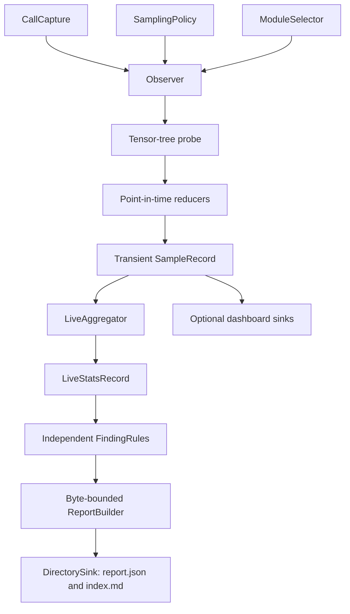

# TorchInstruments: bounded PyTorch research telemetry

**Author**: Vadym Stupakov <vadim.stupakov@gmail.com>

**Status**: Draft

**Created**: 2026-08-14

**Authoritative URL**: https://github.com/Red-Eyed/torchinstruments

## Objective

Instrument a PyTorch model once, train normally with any trainer or custom loop, and continuously
produce compact evidence that helps a researcher choose the next experiment.

## Goals

- Require no calls inside the training loop.
- Add negligible work to unsampled forwards.
- Never persist raw tensors.
- Detect scale drift, gradient change, heavy tails, non-finite values, sparsity changes,
  volatility, oscillation, and regime changes with deterministic local rules.
- Enforce an exact byte budget on the default machine-readable report.
- Give humans and LLMs ranked findings with exact supporting measurements.
- Keep capture, sampling, selection, reduction, aggregation, reporting, and sinks replaceable.
- Preserve model outputs, gradients, parameters, buffers, and checkpoint compatibility.
- Give each distributed rank an explicit, collision-free ownership policy.

## Non-goals

- Persisting every sample or reconstructing a complete historical series by default.
- Asking an LLM to discover important series by reading exhaustive telemetry.
- Combining unrelated diagnostic categories into an opaque health score.
- Observing optimizer updates without an optimizer boundary.
- Calling a sampled root forward a training step.
- Depending on Lightning, TensorBoard, W&B, or Accelerate in the core wheel.
- Coordinating worker completion or performing cross-rank numerical reductions.
- Claiming CUDA-performance or `torch.compile` support before dedicated tests.

## Architecture



The observer is an imperative orchestration shell. Reduction, aggregation, and finding rules are
independent components. The directory sink owns filesystem side effects; pure reporting code does
not read or write files.

## Public workflow

```python
inject_observer(
    model,
    interval=timedelta(minutes=1),
    output_dir="stats",
)
```

`inject_observer()` mutates the model in place and returns `None`. A duplicate injection raises
`ObserverAlreadyAttachedError`. `remove_observer(model)` detaches capture, removes graph-local
gradient callbacks, restores observer-owned forward wrappers, closes sinks, and removes private
observer state.

Native hooks capture normal `module(...)` dispatch. Literal `.forward(...)` users select reversible
wrappers:

```python
inject_observer(model, capture_direct_forwards=True)
```

## Sample lifecycle

A root capture boundary chooses sampling once. A sampled forward receives a unique sample ID and
an independent context, so multiple forwards may remain outstanding before backward.

Selected-module callbacks reduce outputs while the context is active. The observer emits a
transient `forward_complete` `SampleRecord`. A graph-local multi-gradient hook binds output
gradients to tensors from that exact forward. The first correlated backward emits a transient
`backward_observed` event containing only newly relevant measurements and errors.

`DirectorySink` folds those events into bounded live state and immediately derives a compact
research report. `MetricLoggerSink` and `TensorBoardSink` project transient events directly.

## Point-in-time distribution profile

The fused default reducer operates on finite values in a safe floating dtype and emits:

- mean, population standard deviation, RMS, extrema, mean absolute value, and L1/L2 norms;
- finite, zero, positive, and negative fractions;
- skewness and population excess kurtosis;
- `p01`, `p05`, `p25`, median, `p75`, `p95`, `p99`, and `p999`;
- `p99_abs`, `p999_abs`, IQR, and central 98% range;
- max/RMS and absolute-quantile/RMS ratios;
- tail fraction beyond three standard deviations;
- normalized magnitude entropy and effective magnitude support.

Unavailable scalars carry reasons rather than JSON null, NaN, or infinity. Quantiles and higher
moments execute only on sampled forwards.

## Live temporal indicators

`LiveAggregator` maintains bounded state for configured metrics. Every series retains
first/latest/minimum/maximum points, count, and warm-up state. Its indicators include:

- population mean, standard deviation, RMS, and coefficient of variation over time;
- fast/slow EMAs and relative gap;
- absolute and relative momentum;
- online linear-regression slope and `R²`;
- exponentially weighted change and volatility;
- latest z-score against prior history;
- drawdown, runup, and historical-range position;
- positive and negative CUSUM;
- recent lag-one autocorrelation, oscillation fraction, and directional runs.

Recent windows and structural identities have independent limits. Rejected observations are
counted so a report can expose missing coverage instead of silently expanding memory.

## Finding rules

Each `FindingRule` evaluates one series and returns either no candidate or one typed candidate.
Rules are independently replaceable and rank only within their own category:

- activation-scale drift;
- gradient-scale change;
- heavy-tail growth;
- non-finite values;
- zero-fraction growth;
- volatility;
- oscillation;
- regime change.

A ranking score orders comparable candidates within one category. Scores from different
categories have different semantics and must not be compared or added. Each returned finding
includes exact first/latest/extreme values and named rule evidence, so the ranking is auditable.

## Canonical output

```text
stats/
    index.md
    report.json
```

`report.json` contains run and rank metadata, coverage and omission counts, report configuration,
ranked findings, exact evidence, and bounded errors. The default limit is 256,000 UTF-8 bytes and
is checked against the exact serialized representation. Findings are selected round-robin across
categories so one category cannot consume the entire budget.

`index.md` is a compact human projection of the same report. It explains what was observed,
surfaces the strongest findings, records coverage limitations, and includes a ready-to-use LLM
prompt. Both files are sorted deterministically and atomically replaced.

Users who explicitly need the complete live state may opt into `details.json` with
`DirectorySink(..., write_full_details=True)`. That file is for debugging or custom offline
analysis; it can be large and is not the default LLM input.

## Histograms

Histograms are opt-in and have an independent every-N-samples cadence. Fixed edges are exactly
mergeable by adding bin, underflow, overflow, finite, and non-finite counts plus moments. Dynamic
edges retain the latest histogram but make the aggregate explicitly unavailable after edges
change. Histogram-derived tail indicators can enter findings; full histogram detail appears only
in explicitly enabled `details.json` and optional dashboard sinks.

## TensorBoard and custom loggers

Dashboard sinks consume each transient `SampleRecord`. Sample IDs become dashboard steps because
there is no universal optimizer-step counter. The supplied logger remains caller-owned.

TensorBoard retains its own event history for visual exploration. The default JSON report retains
ranked conclusions and evidence, not enough values to replay the dashboard. Both are derived from
the same normalized measurements without copying raw activations to CPU.

## Distributed ownership

`rank_policy="rank0"` is the default. When distributed state or `RANK`/`WORLD_SIZE` identifies a
nonzero worker, injection returns before registering hooks and that worker writes nothing.

`rank_policy="all"` gives each process a private directory:

```text
stats/
    rank-000/report.json
    rank-000/index.md
    rank-001/report.json
    rank-001/index.md
```

No process shares a writer, lock, database, or temporary filename. After workers produce reports,
`merge_rank_reports("stats")` streams one bounded report at a time and atomically writes
`global-report.json` and `global-index.md`. The merged report lists ranks present and whether all
expected ranks were observed; the merger never inserts a barrier or assumes training has ended.

## Performance and scale

Unsampled module callbacks return after one context lookup. Sampled reductions run on the tensor
device and transfer compact reduced values. Aggregator state is bounded by configured series and
structure limits; the default persisted report is independently bounded by exact byte size.

Building a report still scans the selected bounded live state after a sample. Synchronous atomic
writes are appropriate for infrequent sampling; the sink boundary permits a future asynchronous
implementation without changing capture or reduction.

## Error isolation

`raise`, `warn`, and `ignore` policies remain available; `warn` is the default. Non-raising errors
are aggregated by module, probe, exception type, and message. Error count and message length are
bounded in reports. If errors compete with the byte budget, findings take precedence and coverage
records the omission.

## Resolved decisions

### Rank before serialization

**Decision**: Keep bounded sufficient statistics in memory, run deterministic local finding rules,
and persist only the highest-value evidence by default. A report should tell an LLM where to look;
it should not make the LLM pay to rediscover relevance in a huge document.

### Distribution shape

**Decision**: Mean and standard deviation are insufficient for skewed, heavy-tailed, concentrated,
or multimodal values. Include higher moments, quantiles, tail ratios, entropy, and optional
histograms.

### Temporal analysis

**Decision**: Treat important per-layer metrics as bounded time series. Use descriptive indicator
names, expose warm-up, and avoid opaque composite health scores.

### Forward/backward correlation

**Decision**: Keep an independent context and graph-local hook per sampled forward. A single global
collection flag cannot correlate multiple outstanding graphs.

### Direct forward calls

**Decision**: Keep native hooks as the default. Direct `.forward(...)` calls bypass PyTorch hooks,
so an explicit reversible wrapper strategy handles models that use them internally.

### Distributed storage

**Decision**: Use ordinary JSON and Markdown in rank-private directories. This remains portable,
inspectable, and safe on local or network filesystems without a multiprocess database writer.

## Open issues

- Module inputs, `grad_input`, parameters, and parameter gradients are not yet observed.
- Cross-layer ranks and neighboring-layer amplification need a synchronized layer-level pass.
- Cross-rank numerical aggregation needs explicit reduction semantics; current merge ranks already
  reduced findings.
- Both `torch.compile` injection orderings require compatibility tests.
- Very large selected module sets may benefit from asynchronous report construction.

## Roadmap

1. Add input, `grad_input`, parameter, and parameter-gradient signals.
2. Add cross-layer amplification, attenuation, and peer-rank indicators.
3. Add layout-agnostic per-channel and quantization diagnostics.
4. Add distributed numerical aggregation and compilation compatibility.
5. Add optional Transformer, attention, OCR, CNN, and quantization-readiness recipes.
